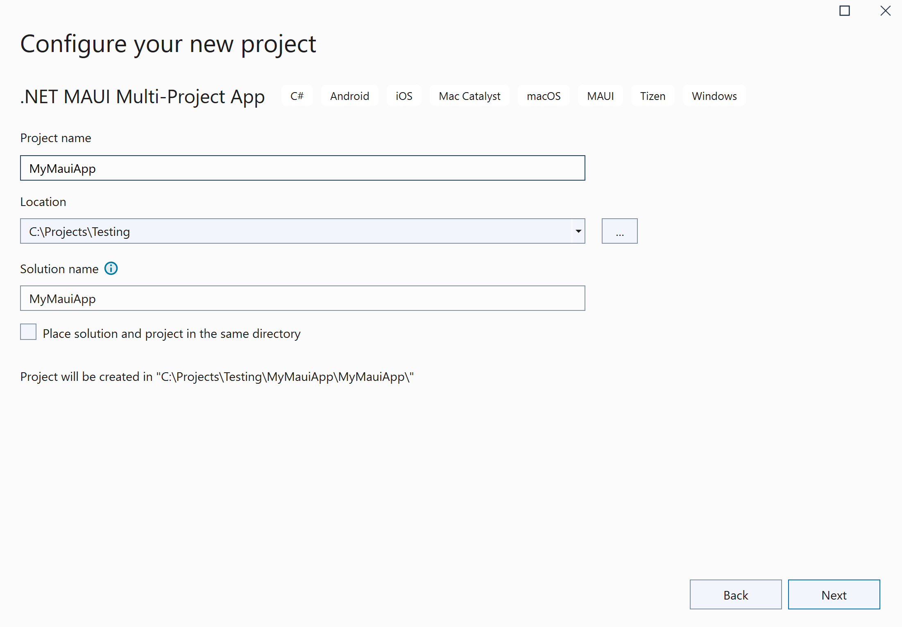

# .NET MAUI Multi-Project App

This is a sample and template to help people during the
migration - or if they still want to keep the multiple projects.
One reason to have multiple projects is if you need to have very
different versions of an app for a single platform.

## Installing

```
dotnet new install MultiHeadMauiTemplates
```

## Uninstalling

```
dotnet new uninstall MultiHeadMauiTemplates
```

## Using

The template should appear in your IDE:


Creating the project is as usual:



The next page will have check boxes for you to select platforms:


## Known "Issues"

There are a few issues that may appear:

 - [Adding UseMaui=true to an iOS/MacCatalyst project causes the Native References and Asset Catalogs to disappear](https://developercommunity.visualstudio.com/t/Adding-UseMauitrue-to-an-iOSMacCatalys/10450689?port=1025&fsid=07a18e73-fe72-4d52-8545-57984bd9481e)
 - Not an "issue" exactly, but because .NET MAUI and WinUI both use XAML, there is no way for each compiler to know what files are supposed to be theirs. To fix this, platforms that use XAML (such as WinUI) also need to set `<EnableDefaultMauiItems>false</EnableDefaultMauiItems>` in the app head.


## Development

To test the template in this repo locally, you can install it:

```
dotnet new install src/Microsoft.Maui.Templates.MauiMultiHeadApp/content --force
```

> If you want to uninstall, you can also use the path:
> 
> ```
> dotnet new uninstall src/Microsoft.Maui.Templates.MauiMultiHeadApp/content
> ```
